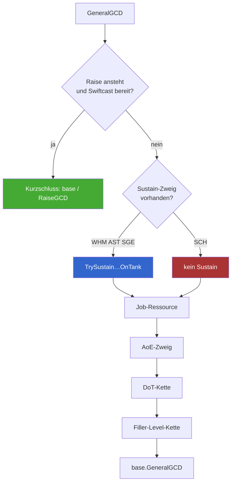
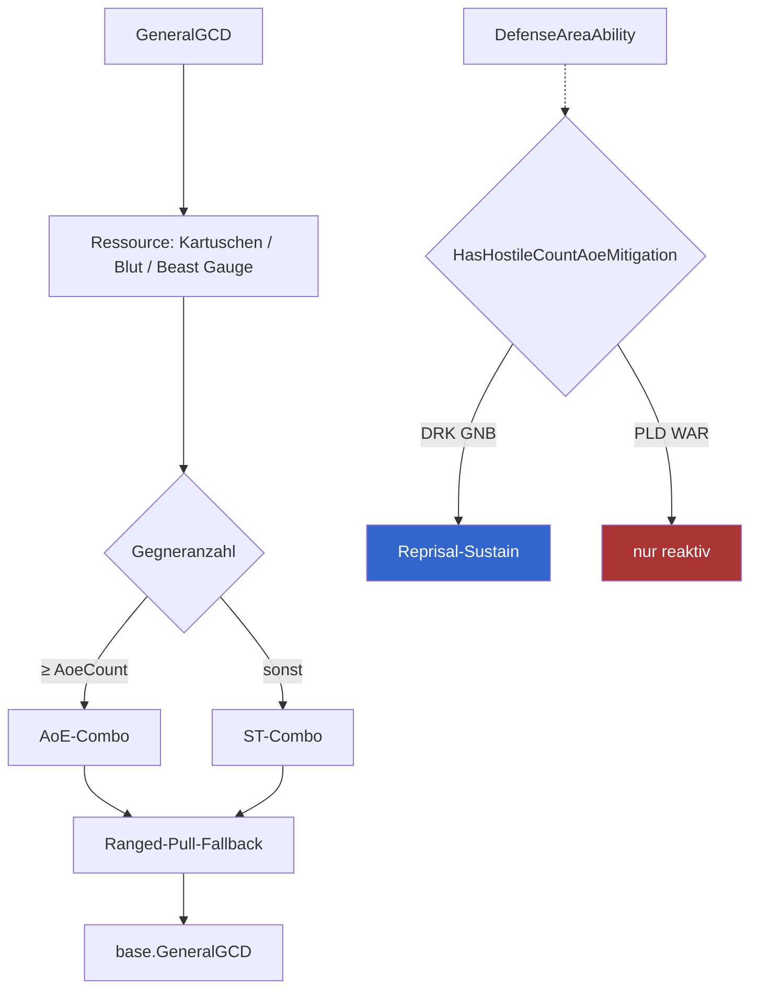
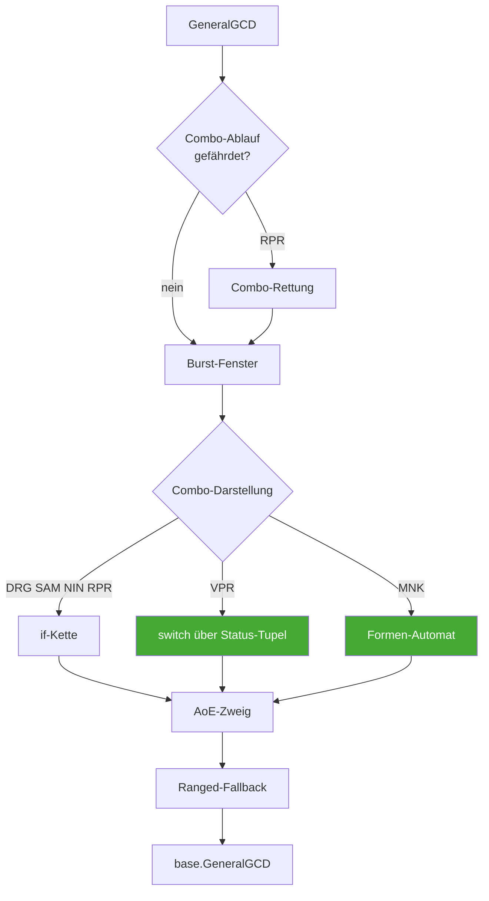
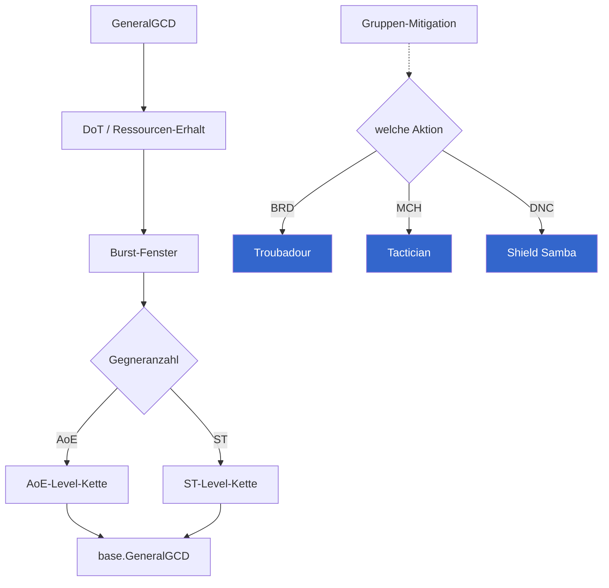
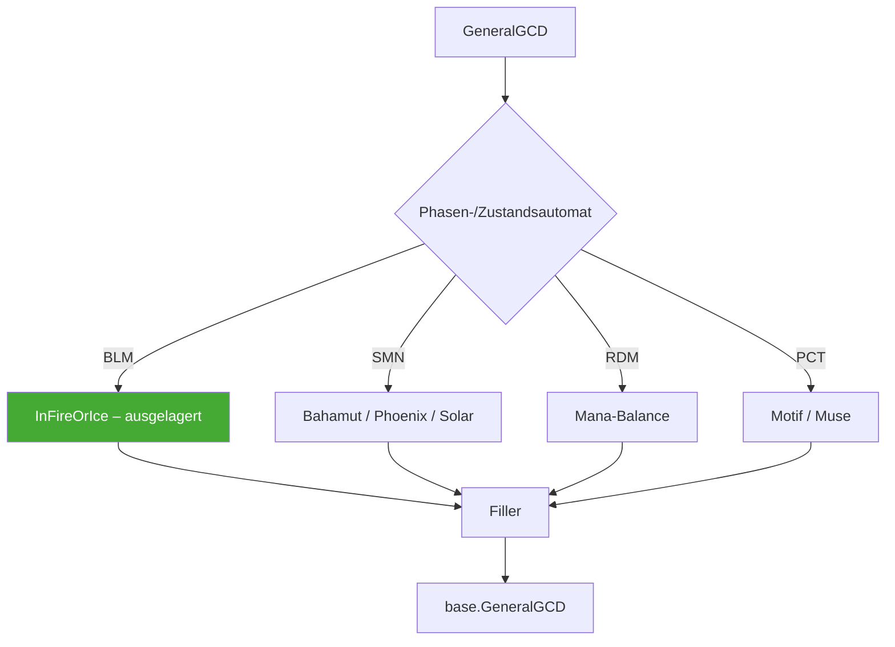

# 02 · Ablaufstruktur je Jobgruppe

Aufbauend auf `01-jobs.md`. Diese Ebene zeigt pro Gruppe, was **gleich**,
**ähnlich** und **unterschiedlich** ist. Farbcode in allen Diagrammen:

- durchgezogen = bei jedem Job der Gruppe vorhanden
- gestrichelt = bei einigen Jobs der Gruppe vorhanden
- Raute = Verzweigung, an der sich die Jobs unterscheiden

---

## Heiler (WHM · AST · SGE · SCH)

### Identisch in allen vier

1. **Raise-Kurzschluss ganz oben.** Wortgleich, 13 Kopien über die vier
   Dateien (jeder Heiler hat ihn zusätzlich in `HealSingleGCD` und
   `HealAreaGCD`). Der einzige Zweig, der die Methode verlässt, bevor
   irgendeine Rotationsentscheidung fällt.
2. **Reihenfolge AoE → DoT → Filler.** Ohne Ausnahme.
3. **Filler ist immer eine Level-Kette** (Glare/Malefic/Dosis/Broil).
4. **`CanHealSingleSpell`/`CanHealAreaSpell`** mit identischem Ausdruck
   `base && (GCDHeal || aliveHealerCount == 1)` — vier wortgleiche Kopien.

### Ähnlich, aber abweichend

| | WHM | AST | SGE | SCH |
|---|---|---|---|---|
| Kurzschlüsse | **2** (ThinAir + Swift) | 1 | 1 | 1 |
| Sustain-Zweig | Regen | Aspected Benefic | Eukr. Diagnosis | **keiner** |
| HP-Boden Sustain | 0.3 | 0.4 | **keiner** | – |
| `GCDHeal`-Default | **true** | false | false | false |
| Ressourcenlogik in GeneralGCD | Lily | **keine** | Phlegma | MP-Schwelle |
| Zweistufiger Cast | nein | nein | **ja** (Eukrasia) | nein |
| Pet-Verwaltung | nein | nein | nein | **ja** (Eos) |

### Wo die Gruppe wirklich auseinanderläuft

Nur an drei Stellen: **Eukrasia-Vorstufe** (SGE), **Pet** (SCH) und
**Kartenlogik** (AST, komplett außerhalb `GeneralGCD`). Alles andere ist
dieselbe Leiter mit anderen Aktionsnamen.

---

## Tanks (PLD · WAR · DRK · GNB)

### Identisch in allen vier

1. **Ressource → AoE/ST-Verzweigung → Combo → Ranged-Fallback.** Gleiche
   Makrostruktur, gleiche Reihenfolge.
2. **Ranged-Pull-Fallback am Ende von `GeneralGCD`**, direkt vor `base`, nur
   durch das eigene `CanUse` gegated: Tomahawk (WAR), Lightning Shot (GNB),
   Shield Lob (PLD), Unmend (DRK). Vier strukturgleiche Zeilen.
3. **`AoeCount = 2`** für die AoE-Aggro-Aktion — bei allen vier explizit
   überschrieben (globaler Default wäre 3).
4. **Keine GCD-Heilung, kein Raise** (Ausnahme PLD/WAR `HealSingleGCD`).

### Wo die Gruppe auseinanderläuft

| | PLD | WAR | DRK | GNB |
|---|---|---|---|---|
| `EmergencyAbility` | ✓ | **fehlt** | ✓ | ✓ |
| `HealSingleGCD` | ✓ Clemency | ✓ | – | – |
| `HasHostileCountAoeMitigation` | **fehlt** | **fehlt** | ✓ | ✓ |
| Reprisal-Sustain in | nur DefenseSingle | nur DefenseSingle | **Area + Single** | **Area + Single** |
| Configs | 15 | 12 | 8 | **2** |

Die PLD/WAR-vs-DRK/GNB-Spaltung bei Reprisal folgt der Upstream-Platzierung
(PLD/WAR haben Reprisal nur in `DefenseSingleAbility`) — sie ist damit
begründet, aber sie macht die Gruppe an einer fachlich einheitlichen Stelle
uneinheitlich.

---

## Melee (DRG · MNK · NIN · RPR · SAM · VPR)

### Identisch in allen sechs

1. **Feint-Sustain** über `ShouldSustainMitigationDebuff(StatusID.Feint)` in
   `DefenseAreaAbility` **und** `DefenseSingleAbility` — nach der
   Vereinheitlichung eine Zeile pro Stelle, zwölf Stellen gesamt.
2. **Ranged-Fallback am Ende** (Piercing Talon, Writhing Snap, Harpe …).
3. **`HasHostileCountAoeMitigation = true`** bei allen sechs.
4. **`HealSingleAbility`** (Second Wind/Bloodbath) — außer MNK.

### Wo die Gruppe auseinanderläuft

| | DRG | MNK | NIN | RPR | SAM | VPR |
|---|---|---|---|---|---|---|
| `CountDownAction` | **fehlt** | ✓ | ✓ | ✓ | ✓ | **fehlt** |
| `EmergencyAbility` | ✓ | ✓ | ✓ | **fehlt** | **fehlt** | ✓ |
| `HealSingleAbility` | ✓ | **fehlt** | ✓ | ✓ | ✓ | ✓ |
| `HealAreaAbility` | – | **✓** | – | – | – | – |
| `HasOwnInterruptGate` | – | – | – | ✓ | – | ✓ |
| Combo-Form | if-Kette | Automat | Automat | if-Kette | if-Kette | switch |
| Trait-Duplikate | **8 Paare** | – | – | – | – | – |

MNKs `HealAreaAbility`-statt-`HealSingleAbility` ist die einzige Abweichung
ohne erkennbare fachliche Begründung.

---

## Physische Fernkämpfer (BRD · MCH · DNC)

### Identisch in allen drei

1. **Rollen-Mitigation als Selbstbuff** (Troubadour/Tactician/Shield Samba) —
   dieselbe Rolle, dieselbe Dauer (15 s), dieselbe BMR-Refresh-Logik.
2. **Level-Ketten dominieren den Filler.**
3. **Kein Raise, keine GCD-Heilung.**

### Wo die Gruppe auseinanderläuft

| | BRD | MCH | DNC |
|---|---|---|---|
| `DefenseSingleAbility` | ✓ | ✓ | **fehlt** |
| `HealAreaAbility` | – | – | **✓** |
| `HealSingleAbility` | ✓ | **fehlt** | ✓ |
| `DispelAbility` | **✓** | – | – |
| `MoveForwardAbility` | – | – | ✓ |
| Level-Ketten-Glieder | 2 | **12** | 0 |

Die Gruppe ist bei den Hooks am inkonsistentesten: keine zwei Jobs belegen
dieselbe Slot-Menge.

---

## Magische Fernkämpfer (SMN · RDM · PCT · BLM)

### Identisch in allen vier

1. **Addle-Sustain** über `ShouldSustainMitigationDebuff(StatusID.Addle)` in
   beiden Defense-Slots.
2. **`HasHostileCountAoeMitigation = true`.**
3. **Ein Zustandsautomat als Kern**, Filler nur als Rest.

### Wo die Gruppe auseinanderläuft

| | SMN | RDM | PCT | BLM |
|---|---|---|---|---|
| Automat liegt in | `GeneralGCD` | `GeneralGCD` | `GeneralGCD` | **privaten Methoden** |
| Top-Level-Zweige | 24 | 22 | 33 | **7** |
| `HealSingleGCD` | ✓ | ✓ | – | – |
| `RaiseGCD` | ✓ | ✓ | – | – |
| `MoveForwardGCD` | ✓ | – | – | – |
| Configs | 14 | 9 | 8 | 4 |

BLM erreicht mit **7** Top-Level-Zweigen dieselbe fachliche Abdeckung, für die
PCT **33** braucht. Der Unterschied ist reine Ablauforganisation, nicht
Job-Komplexität — das ist der stärkste Einzelbefund dieser Ebene.

---

## Gruppenvergleich in einer Tabelle

| Gruppe | gemeinsame Makrostruktur | echte Abweichungen | unbegründete Abweichungen |
|---|---|---|---|
| Heiler | Kurzschluss → Sustain → Ressource → AoE → DoT → Filler | Eukrasia, Pet, Karten | SCH ohne Sustain, HP-Boden 0.3/0.4/keiner |
| Tanks | Ressource → AoE/ST → Combo → Ranged-Fallback | – | WAR ohne Emergency, PLD/WAR ohne HCA-Flag |
| Melee | Burst → Combo → AoE → Ranged-Fallback | Mudra, Formen, Positionals | DRG/VPR ohne CountDown, MNK-Heal-Slot |
| Phys. Ranged | DoT/Ressource → Burst → AoE/ST | Tänze (DNC) | drei verschiedene Slot-Mengen |
| Mag. Ranged | Automat → Filler | Elementphasen | Automat mal ausgelagert, mal inline |
