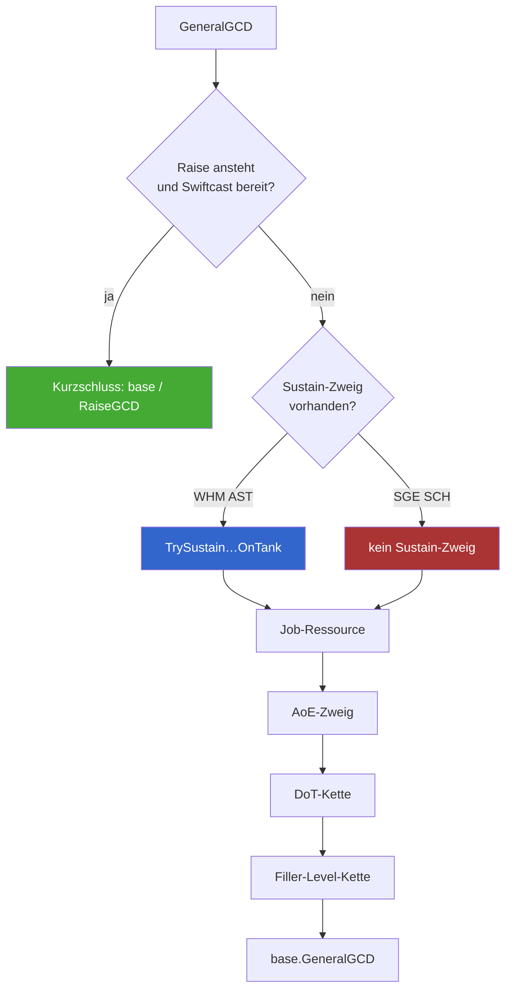
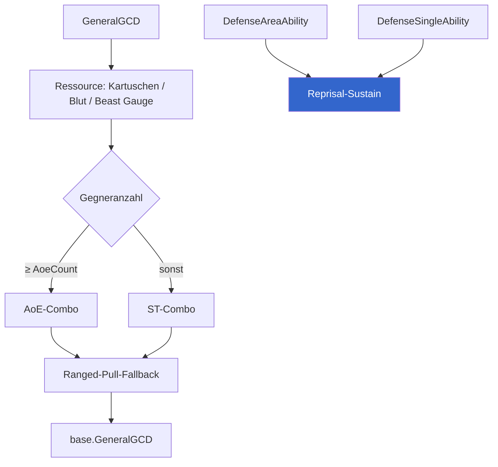
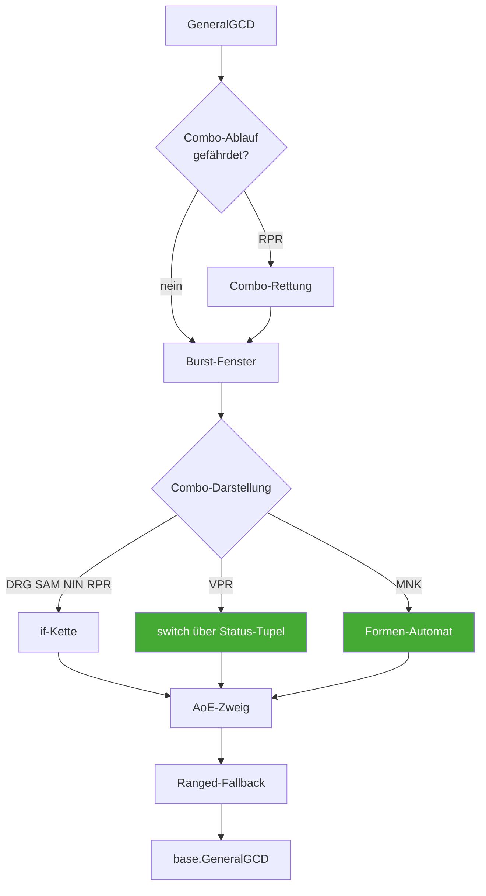
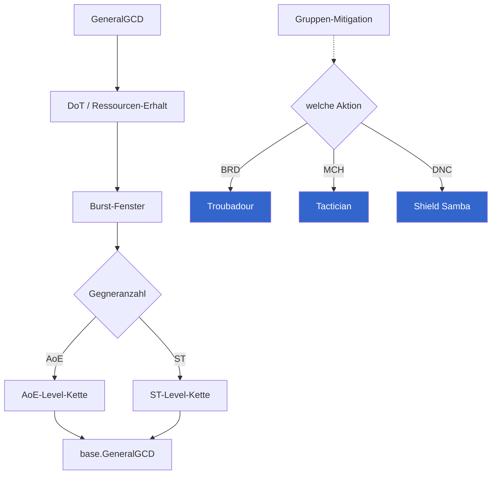
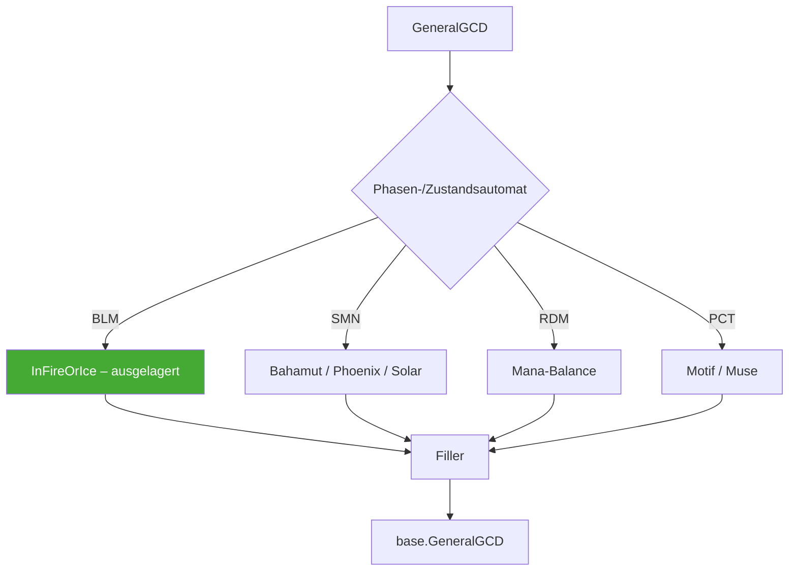

# 02 · Ablaufstruktur je Jobgruppe

Aufbauend auf `01-jobs.md`. Diese Ebene zeigt pro Gruppe, was **gleich**,
**ähnlich** und **unterschiedlich** ist. Hooks, Optionen und Voreinstellungen am 02.10.2026 aus dem Code gemessen. Farbcode in allen Diagrammen:

- durchgezogen = bei jedem Job der Gruppe vorhanden
- gestrichelt = bei einigen Jobs der Gruppe vorhanden
- Raute = Verzweigung, an der sich die Jobs unterscheiden

---

## Heiler (WHM · AST · SGE · SCH)

```mermaid
flowchart TD
    A[GeneralGCD] --> B{Raise ansteht<br/>und Swiftcast bereit?}
    B -- ja --> C[Kurzschluss: base / RaiseGCD]
    B -- nein --> D{Sustain-Zweig<br/>vorhanden?}
    D -- "WHM AST" --> E[TrySustain…OnTank]
    D -- "SGE SCH" --> F[kein Sustain-Zweig]
    E --> G[Job-Ressource]
    F --> G
    G --> H[AoE-Zweig]
    H --> I[DoT-Kette]
    I --> J[Filler-Level-Kette]
    J --> K[base.GeneralGCD]

    style C fill:#4a3,color:#fff
    style E fill:#36c,color:#fff
    style F fill:#a33,color:#fff
```

### Identisch in allen vier

1. **Raise-Kurzschluss ganz oben.** `SwiftRaisePending`, je Datei privat und gleichlautend, 13 Verwendungen
   (jeder Heiler hat ihn zusätzlich in `HealSingleGCD` und `HealAreaGCD`). Der einzige Zweig, der die Methode verlässt, bevor
   irgendeine Rotationsentscheidung fällt.
2. **Reihenfolge AoE → DoT → Filler.** Ohne Ausnahme.
3. **Filler ist immer eine Level-Kette** (Glare/Malefic/Dosis/Broil).
4. **`CanHealSingleSpell`/`CanHealAreaSpell`** mit identischem Ausdruck
   `base && (GCDHeal || aliveHealerCount == 1)` — vier wortgleiche Kopien.

### Ähnlich, aber abweichend

| | WHM | AST | SGE | SCH |
|---|---|---|---|---|
| Kurzschlüsse | **2** (ThinAir + Swift) | 1 | 1 | 1 |
| Sustain-Zweig in `GeneralGCD` | Regen | Aspected Benefic | **keiner** (entfernt, A5) | **keiner** |
| Pflege auf dem Tank im Pull (`TryPullUpkeepOnTank`) | Regen | Aspected Benefic | Eukr. Diagnosis, ab Werk aus | **nicht gebaut** |
| HP-Schwelle der Pflege | `RegenHeal` 0.3 | `AspectedBeneficHeal` 0.4 | keine (Konzept 15) | – |
| `GCDHeal`-Default | **true** | false | false | **true** |
| Ressourcenlogik in GeneralGCD | Lily | **keine** | Phlegma | MP-Schwelle |
| Zweistufiger Cast | nein | nein | **ja** (Eukrasia) | nein |
| Pet-Verwaltung | nein | nein | nein | **ja** (Eos) |

### Wo die Gruppe wirklich auseinanderläuft

Nur an drei Stellen: **Eukrasia-Vorstufe** (SGE), **Pet** (SCH) und
**Kartenlogik** (AST, komplett außerhalb `GeneralGCD`). Alles andere ist
dieselbe Leiter mit anderen Aktionsnamen.

---

## Tanks (PLD · WAR · DRK · GNB)

```mermaid
flowchart TD
    A[GeneralGCD] --> B[Ressource: Kartuschen / Blut / Beast Gauge]
    B --> C{Gegneranzahl}
    C -- "≥ AoeCount" --> D[AoE-Combo]
    C -- "sonst" --> E[ST-Combo]
    D --> F[Ranged-Pull-Fallback]
    E --> F
    F --> G[base.GeneralGCD]

    H[DefenseAreaAbility] --> J[Reprisal-Sustain]
    L[DefenseSingleAbility] --> J

    style J fill:#36c,color:#fff
```

### Identisch in allen vier

1. **Ressource → AoE/ST-Verzweigung → Combo → Ranged-Fallback.** Gleiche
   Makrostruktur, gleiche Reihenfolge.
2. **Ranged-Pull-Fallback am Ende von `GeneralGCD`**, direkt vor `base`, nur
   durch das eigene `CanUse` gegated: Tomahawk (WAR), Lightning Shot (GNB),
   Shield Lob (PLD), Unmend (DRK). Vier strukturgleiche Zeilen.
3. **`AoeCount = 2`** für die AoE-Aggro-Aktion — bei allen vier explizit
   überschrieben (globaler Default wäre 3).
4. **Kein Raise; GCD-Heilung nur beim Paladin** (Clemency, `HealSingleGCD`).
5. **Reflexion in Flächen- und Einzelabwehr** über `ShouldSustainMitigationDebuff` (00bc9c6f), am Tankbuster mit
   `HoldReprisalForRaidwide` (A244).
6. **`HasOwnArmsLengthPullRule`**: Abtausch im Pull nach der eigenen Regel, nie auf einen Boss (A236).

### Wo die Gruppe auseinanderläuft

| | PLD | WAR | DRK | GNB |
|---|---|---|---|---|
| `EmergencyAbility` | ✓ Reborn | ✓ Basisschicht (Holmgang) | ✓ Basis + Reborn | ✓ Basis + Reborn |
| `HealSingleGCD` | ✓ Clemency | – | – | – |
| `HealSingleAbility` | – | ✓ | ✓ | ✓ |
| `MyInterruptGCD` | ✓ | – | – | – |
| Configs | 16 | 17 | 12 | **3** |

Die frühere Spaltung bei Reflexion (Paladin und Krieger nur in der Einzelabwehr) ist aufgehoben (00bc9c6f).
`HasHostileCountAoeMitigation` gibt es nicht mehr: Es setzte `DefenseArea` allein auf die Gegnerzahl und
öffnete damit die ganze Abwehrkette (b8018cf0, Konzept 08).

---

## Melee (DRG · MNK · NIN · RPR · SAM · VPR)

```mermaid
flowchart TD
    A[GeneralGCD] --> B{Combo-Ablauf<br/>gefährdet?}
    B -- "RPR" --> C[Combo-Rettung]
    B -- nein --> D[Burst-Fenster]
    C --> D
    D --> E{Combo-Darstellung}
    E -- "DRG SAM NIN RPR" --> F[if-Kette]
    E -- "VPR" --> G[switch über Status-Tupel]
    E -- "MNK" --> H[Formen-Automat]
    F --> I[AoE-Zweig]
    G --> I
    H --> I
    I --> J[Ranged-Fallback]
    J --> K[base.GeneralGCD]

    style G fill:#4a3,color:#fff
    style H fill:#4a3,color:#fff
```

### Identisch in allen sechs

1. **Feint-Sustain** über `ShouldSustainMitigationDebuff(StatusID.Feint)` in
   `DefenseAreaAbility` **und** `DefenseSingleAbility` — eine Zeile pro Stelle, zwölf Stellen gesamt; beim Ninja
   in der versiegelten `NinjaRotation`.
2. **Ranged-Fallback am Ende** (Piercing Talon, Writhing Snap, Harpe …); der Mönch hat keinen.
3. **`HealSingleAbility`** (Second Wind/Bloodbath) bei allen sechs.

### Wo die Gruppe auseinanderläuft

| | DRG | MNK | NIN | RPR | SAM | VPR |
|---|---|---|---|---|---|---|
| `CountDownAction` | **fehlt** | ✓ | ✓ | ✓ | ✓ | **fehlt** |
| `EmergencyAbility` | ✓ | ✓ | ✓ | **fehlt** | **fehlt** | ✓ |
| `HealAreaAbility` | – | **✓** (Earth's Reply, Mantra) | – | – | – | – |
| `HasOwnInterruptGate` | – | – | – | ✓ | – | ✓ |
| Combo-Form | if-Kette | Automat | Automat | if-Kette | if-Kette | switch |
| Trait-Duplikate | **6 Paare** | – | – | – | – | – |

Der Mönch führt Second Wind und Bloodbath seit 4b3c9412 in `HealSingleAbility`; `HealAreaAbility` trägt seine
Gruppenheilungen.

---

## Physische Fernkämpfer (BRD · MCH · DNC)

```mermaid
flowchart TD
    A[GeneralGCD] --> B[DoT / Ressourcen-Erhalt]
    B --> C[Burst-Fenster]
    C --> D{Gegneranzahl}
    D -- AoE --> E[AoE-Level-Kette]
    D -- ST --> F[ST-Level-Kette]
    E --> G[base.GeneralGCD]
    F --> G

    H[Gruppen-Mitigation] -.-> I{welche Aktion}
    I -- BRD --> J[Troubadour]
    I -- MCH --> K[Tactician]
    I -- DNC --> L[Shield Samba]

    style J fill:#36c,color:#fff
    style K fill:#36c,color:#fff
    style L fill:#36c,color:#fff
```

### Identisch in allen drei

1. **Gruppen-Minderung** (Troubadour/Tactician/Shield Samba) —
   dieselbe Rolle, dieselbe Dauer (15 s), dieselbe BMR-Auslösung (`BMRShouldRefreshBefore` vor Raidwide und
   Tankbuster).
2. **Level-Ketten dominieren den Filler.**
3. **Kein Raise, keine GCD-Heilung; Second Wind in `HealSingleAbility` bei allen drei.**

### Wo die Gruppe auseinanderläuft

| | BRD | MCH | DNC |
|---|---|---|---|
| `HealAreaAbility` | – | – | **✓** (Curing Waltz, Improvisation) |
| `DispelAbility` | **✓** (Warden's Paean) | – | – |
| `MoveForwardAbility` | – | – | ✓ (En Avant) |
| `MoveBackAbility` | ✓ (Repelling Shot) | – | – |
| Level-Ketten-Glieder | 2 | **12** | 0 |

Die verbleibenden Unterschiede folgen den Aktionen, die nur ein Job hat (A7, 4b3c9412).

---

## Magische Fernkämpfer (SMN · RDM · PCT · BLM)

```mermaid
flowchart TD
    A[GeneralGCD] --> B{Phasen-/Zustandsautomat}
    B -- "BLM" --> C[InFireOrIce – ausgelagert]
    B -- "SMN" --> D[Bahamut / Phoenix / Solar]
    B -- "RDM" --> E[Mana-Balance]
    B -- "PCT" --> F[Motif / Muse]
    C --> G[Filler]
    D --> G
    E --> G
    F --> G
    G --> H[base.GeneralGCD]

    style C fill:#4a3,color:#fff
```

### Identisch in allen vier

1. **Addle-Sustain** über `ShouldSustainMitigationDebuff(StatusID.Addle)` in
   beiden Defense-Slots (beim Beschwörer über `TryAddleBeforeDamage`).
2. **Ein Zustandsautomat als Kern**, Filler nur als Rest.

### Wo die Gruppe auseinanderläuft

| | SMN | RDM | PCT | BLM |
|---|---|---|---|---|
| Automat liegt in | benannten Stufen (A4a) | `GeneralGCD` | benannten Stufen (A4a) | **privaten Methoden** |
| Top-Level-Zweige vor A4a | 24 | 22 | 33 | **7** |
| `HealSingleGCD` | ✓ | ✓ | – | – |
| `RaiseGCD` | ✓ | ✓ | – | – |
| `MoveForwardGCD` | ✓ | – | – | – |
| Configs | 13 | 9 | 8 | 5 |

BLM erreichte mit **7** Top-Level-Zweigen dieselbe fachliche Abdeckung, für die
PCT **33** brauchte. Der Unterschied ist reine Ablauforganisation, nicht
Job-Komplexität; A4a hat PCT und SMN deshalb in benannte Stufen zerlegt.

---

## Gruppenvergleich in einer Tabelle

| Gruppe | gemeinsame Makrostruktur | echte Abweichungen | unbegründete Abweichungen |
|---|---|---|---|
| Heiler | Kurzschluss → Sustain → Ressource → AoE → DoT → Filler | Eukrasia, Pet, Karten | Gelehrter ohne Pflege im Pull (kein Sofortschild, Konzept 15) |
| Tanks | Ressource → AoE/ST → Combo → Ranged-Fallback | – | Unverwundbarkeit an zwei Orten (Konzept 05) |
| Melee | Burst → Combo → AoE → Ranged-Fallback | Mudra, Formen, Positionals | DRG/VPR ohne CountDown (TODO „Vorlauf“) |
| Phys. Ranged | DoT/Ressource → Burst → AoE/ST | Tänze (DNC) | – |
| Mag. Ranged | Automat → Filler | Elementphasen | Automat mal ausgelagert, mal inline |
