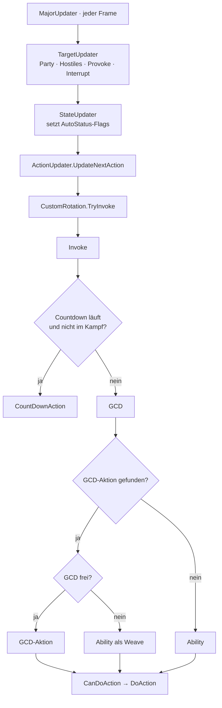

# 03 · Was bei allen Jobs identisch oder ähnlich ist

Diese Ebene beschreibt das, was *kein* Job selbst besitzt, sondern was ihm die
zentrale Maschinerie vorgibt — plus die Muster, die zwar in jedem Job einzeln
stehen, aber überall gleich aussehen.

---

## A · Der Rahmen: eine Entscheidung pro Frame



**Universelle Invariante:** Pro Frame entsteht genau *eine* Aktion. Kein Job
kann zwei Aktionen ausgeben, keiner kann die Reihenfolge des Rahmens ändern.
Jobs füllen ausschließlich Slots, sie steuern den Ablauf nicht.

**Zweite Invariante:** `StateUpdater` entscheidet *ob* ein Slot überhaupt
angefragt wird, der Job entscheidet nur *womit* er ihn füllt. Ein Job kann
eine Heilung nicht erzwingen, wenn `AutoStatus.HealSingleSpell` nicht gesetzt
ist — das ist die Ursache fast aller „warum feuert X nicht"-Fälle im
AUDIT_LOG.

---

## B · Die Slot-Kette (identisch für jeden Job)

```
GCD()                                    Ability()
─────────────────────────────────        ─────────────────────────────────
 1  CommandNextAction                     1  NoCasting-Sperre
 2  NoCasting-Sperre                      2  EmergencyAbility
 3  Job-Cast-Sperren (PLD/AST/BLU/NIN)    3  InterruptAbility
 4  EmergencyGCD                          4  DispelAbility
 5  MyInterruptGCD                        5  Shirk
 6  DispelGCD                             6  TankStance
 7  ProvokeGCD                            7  AntiKnockback
 8  RaiseSpell   (wenn RaisePlayerFirst)  8  TrueNorth / Positional
 9  MoveForwardGCD                        9  HealAreaAbility
10  HealAreaGCD                          10  HealSingleAbility
11  HealSingleGCD                        11  SpeedAbility
12  DefenseAreaGCD                       12  ProvokeAbility
13  DefenseSingleGCD                     13  DefenseAreaAbility
14  RaiseSpell   (sonst)                 14  DefenseSingleAbility
15  GeneralGCD                           15  MoveForward / MoveBack
                                         16  HP-Potion
                                         17  AttackAbility
                                         18  GeneralAbility
                                         19  MP-Potion · GeneralUsing · Speed
```

Beide Ketten sind **fest verdrahtet** und für alle Jobs gleich. Zwei
Konsequenzen, die im ganzen AUDIT_LOG immer wieder auftauchen:

- Alles oberhalb von `GeneralGCD` kann `GeneralGCD` **aushungern**. Ein
  gesetztes Heil-Flag verhindert dauerhaft, dass ein Zweig in `GeneralGCD`
  jemals drankommt — unabhängig davon, wie wichtig er ist.
- Wer proaktive Logik in `GeneralGCD` platziert, muss sie in `HealAreaGCD` und
  `HealSingleGCD` **wiederholen**, sonst greift sie im Heilfall nicht. Genau
  das war die Ursache der „HoT wird nicht aufrechterhalten"-Meldungen.

---

## C · Muster, die in jedem Job wiederkehren

### C1 · Level-Kette (65 Ketten in 16 Dateien)

Immer dieselbe Form:

```
if (  HöchsteStufe.EnoughLevel &&  HöchsteStufe.CanUse(out act)) return true;
if ( !HöchsteStufe.EnoughLevel &&  MittlereStufe.CanUse(out act)) return true;
if ( !MittlereStufe.EnoughLevel && Basisstufe.CanUse(out act))   return true;
```

Zwei eingebaute Fehlerquellen:

1. Der linke Teil `X.EnoughLevel && X.CanUse` ist **redundant** —
   `ActionBasicInfo.BasicCheck` prüft `EnoughLevel` bereits selbst und bricht
   ab. 43 Vorkommen im Repo.
2. Der Ausschluss der höheren Stufe wird **von Hand** geschrieben und mal als
   `!X.EnoughLevel`, mal als `!X.Info.EnoughLevelAndQuest()` formuliert. Beide
   Varianten kommen nebeneinander vor. Genau hier entstand der bereits
   behobene RDM-Fehler `!EnoughLevel && EnoughLevel`.

### C2 · Sustain-Zweig (proaktives Aufrechterhalten)

Seit der Vereinheitlichung überall identisch aufgebaut:

```
Auslöser (BMR-Vorhersage ODER Gegneranzahl)  →  Dauer-Prüfung  →  CanUse
```

Zentral als `ShouldSustainMitigationDebuff(...)` für Addle/Feint/Reprisal,
job-eigen als `TrySustain…OnTank(...)` bei den Heilern. Vorher: 25 bzw. 9
Kopien.

### C3 · AoE-vs-ST-Verzweigung

Jeder Job hat sie, aber an **drei verschiedenen Orten**:

| Ort | Jobs | Mechanik |
|---|---|---|
| implizit über `AoeCount` in `CanUse` | die meisten | Zielsystem entscheidet |
| explizit über `NumberOfHostilesInRange >= n` | SAM, früher 26 Stellen | Job entscheidet |
| über eigene Zählhilfen | BLU, VPR | Job zählt selbst |

### C4 · Ranged-Fallback am Ende von `GeneralGCD`

Tanks und Melee: letzter Zweig vor `base.GeneralGCD`, nur durch das eigene
`CanUse` gegated. Zehn strukturgleiche Zeilen.

### C5 · Kurzschluss ganz oben

Heiler: Swiftcast+Raise. Melee: Combo-Rettung. Struktur identisch — *verlasse
die Methode, bevor Rotationslogik läuft* —, Formulierung jedes Mal neu.

---

## D · Was tatsächlich zentral gelöst ist (Positivliste)

Damit der Umbauvorschlag in `04-concept.md` nicht Dinge „zentralisiert", die
es schon sind:

| Bereich | zentraler Ort |
|---|---|
| Zielauswahl inkl. AoE-Zählung | `ActionTargetInfo.FindTarget` |
| Nutzbarkeitsprüfung (Level, MP, Combo, Status, Cooldown, TTK) | `BaseAction.CanUse` → `ActionBasicInfo.BasicCheck` |
| Flag-Erzeugung (wann wird geheilt/mitigiert) | `StateUpdater` |
| Statusdauer-Rechnung | `StatusHelper.WillStatusEnd*` |
| BMR-Vorhersage-Zugriff | `CustomRotation_OtherInfo.BMR*` |
| Rollen-Standards (Interrupt, Anti-Knockback, True North, Potions) | `CustomRotation_Ability` |
| Mitigations-Sustain | `ShouldSustainMitigationDebuff` |

---

## E · Universelle Strukturschwächen

| # | Schwäche | Beleg |
|---|---|---|
| U1 | `GeneralGCD` ist Sammelbecken ohne Untergliederung | 7–81 Zweige auf einer Ebene, Median ~19 |
| U2 | Proaktive Logik muss in 3 Methoden dupliziert werden | Heiler-Sustain, vorher 9 Kopien |
| U3 | Level-Ketten von Hand | 65 Ketten, 2 Schreibweisen, 1 realer Bug daraus |
| U4 | Hook-Belegung ohne Regel | 2 Jobs ohne CountDown, 3 ohne Emergency, MNK/DNC-Heal-Slot-Tausch |
| U5 | Gleiche Rolle, verschiedene Orte | AoE-Schwelle an 3 Orten; Mitigation mal Area, mal Single, mal beides |
| U6 | Kein Job kann sagen „ich bin fertig" | jede Ebene muss `base.X` aufrufen; Vergessen/Vertauschen war die häufigste Fehlerklasse im AUDIT_LOG (9 Fälle) |

U6 ist der unauffälligste und teuerste Punkt: die Kette wird über
`return base.Methode(out act)` fortgesetzt, und ein falscher Methodenname im
`base`-Aufruf ist syntaktisch korrekt, kompiliert und ist im Diff unsichtbar.
Neun solcher Fälle stehen im AUDIT_LOG.
