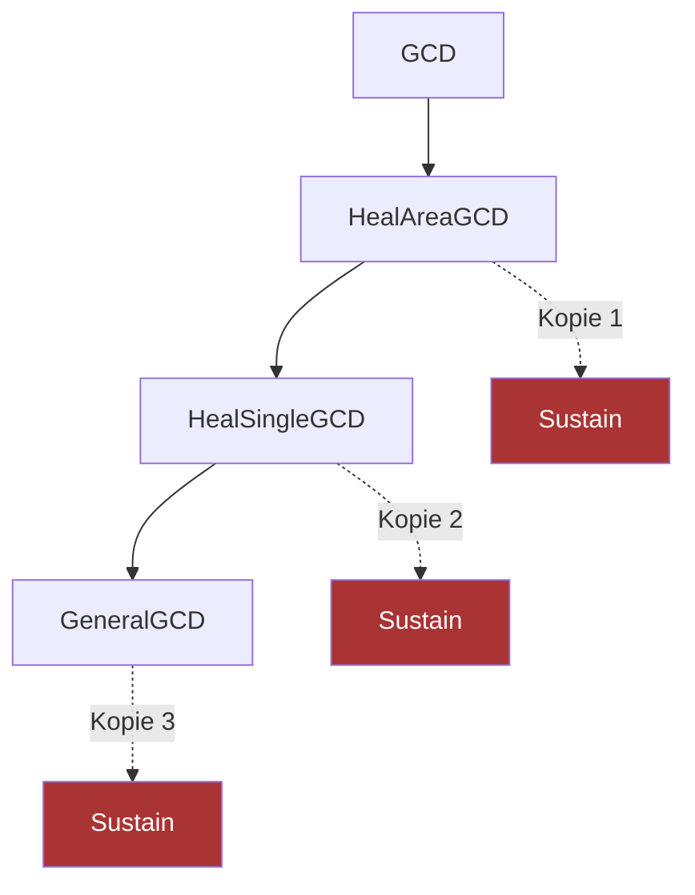
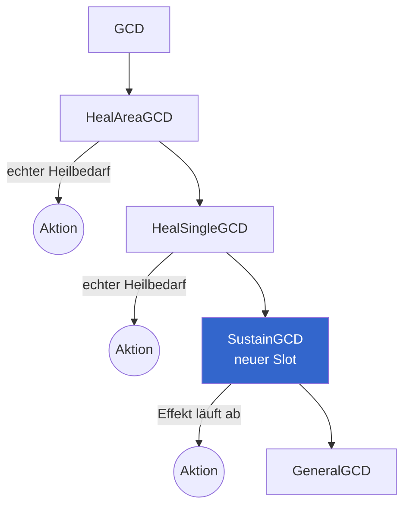

# 04 · Zielkonzept

Ergebnis des internen Audits (Council → Critic → Antithese → Evaluation →
Revision, drei Durchläufe). Dokumentiert ist der Endstand plus die
Gegenargumente, die ihn geformt haben — nicht der geglättete Verlauf.

**Reihenfolge nach Wirkbreite:** A wirkt auf alle Jobs, B auf eine Gruppe,
C auf einen Job. Später kommende Stufen setzen frühere voraus, nie umgekehrt.

---

## Randbedingung, die alles andere begrenzt

```
CustomRotation                     handgeschrieben, gemeinsam
      ↓
{Job}Rotation                      GENERIERT (RotationGetter.cs:47)
      ↓
{Job}_Reborn                       handgeschrieben, je Job
```

Es gibt **keine Rollenebene**. Eine einzuziehen hieße, den Codegenerator zu
ändern — Build-Werkzeug, hohes Risiko, und es bringt nichts, was ein benannter
Helfer auf `CustomRotation` nicht auch leistet. **Entscheidung: keine neue
Vererbungsebene.** Rollenlogik lebt als rollenbenannter Helfer, so wie
`ShouldSustainMitigationDebuff` es bereits vormacht.

---

# A · Global (alle Jobs)

## A1 · Sustain-Slot im Dispatch statt dreifacher Kopie

**Problem (U2):** Proaktive Logik muss in `GeneralGCD`, `HealSingleGCD` und
`HealAreaGCD` stehen, sonst hungert sie aus. Neun Kopien bei drei Heilern; das
Auffinden dieses einen Fehlers hat eine komplette Sitzung gekostet.

**Heute:**



**Ziel:**



Der Slot sitzt **nach** den Heilmethoden und **vor** `GeneralGCD`. Damit ist
die Regel im Ablauf selbst ausgedrückt, ohne Kommentar:

> Echte Heilung schlägt Sustain. Sustain schlägt Schaden.

Signatur, Standard leer, also für 20 der 23 Jobs wirkungslos:

```csharp
protected virtual bool SustainGCD(out IAction? act) { act = null; return false; }
```

**Aufwand:** ~6 Zeilen Dispatch, 1 virtuelle Methode, minus 6 Aufrufstellen
und minus 3 Wiederholungen bei WHM/AST/SGE.

**Nebeneffekt:** Löst TODO #63 auf. Die Frage „soll der HP-Boden auch in
`GeneralGCD` gelten" verschwindet, weil es keinen `GeneralGCD`-Zweig mehr
gibt — es gibt nur noch einen Ort, und der liegt hinter den echten Heilungen.

## A2 · `FirstUsable` statt handgeschriebener Level-Ketten

**Problem (U3):** 52 Kettenglieder in 12 Dateien, 43 davon mit redundantem
`X.EnoughLevel &&` (das prüft `BasicCheck` bereits), zwei konkurrierende
Schreibweisen für den Ausschluss der höheren Stufe, ein daraus real
entstandener Bug (RDM `!EnoughLevel && EnoughLevel`, AUDIT_LOG).

**Heute** (WHM-Filler, sechs Glieder, gekürzt):

```
if ( GlareIii.EnoughLevel && GlareIii.CanUse(out act)) return true;
if ( Glare.EnoughLevel && !GlareIii.EnoughLevel && Glare.CanUse(out act)) return true;
if ( StoneIv.EnoughLevel && !Glare.EnoughLevel && StoneIv.CanUse(out act)) return true;
…
```

**Ziel:**

```
if (FirstUsable(out act, GlareIii, Glare, StoneIv, StoneIii, StoneIi, Stone)) return true;
```

Die Reihenfolge *ist* die Aussage: höchste Stufe zuerst. `CanUse` scheitert
bei zu niedrigem Level ohnehin — der Ausschluss der höheren Stufe ist damit
überflüssig, nicht nur kürzer.

**Vom Critic erzwungene Präzisierung:** kein `params`-Array. Die Methode läuft
im Per-Frame-Pfad; ein `params IBaseAction[]` allokiert bei jedem Aufruf. Feste
Überladungen für 2–6 Argumente, allokationsfrei — passend zu der Konvention,
aus der das Repo überall `foreach` statt LINQ verwendet.

**Aufwand:** 5 kleine Überladungen zentral, danach −52 Zeilen über 12 Dateien.

## A3 · Base-Call-Prüfung in der CI

**Problem (U6):** `return base.FalscheMethode(out act);` kompiliert, ist im
Diff unsichtbar und war mit **neun** Fällen die häufigste Fehlerklasse im
gesamten AUDIT_LOG.

**Ziel:** Kein Laufzeitcode. Ein Prüfskript im vorhandenen Build-Workflow:
jede `override bool X(...)` darf im `base.`-Aufruf nur `X` nennen. Ausnahmen
über eine kurze Allowlist mit Begründung.

Die Machbarkeit ist belegt — der Parser, der die Skelette für `01-jobs.md`
extrahiert hat, ist genau dieser Parser.

**Aufwand:** ~40 Zeilen Skript, ein Schritt in `build.yaml`, kein Produktivcode.

## A4 · Gemeinsames Vokabular für Ablaufstufen

**Problem (U1):** `GeneralGCD` hat zwischen 7 und 81 Zweige auf einer Ebene.
Der Median liegt bei ~19. Es gibt keine Untergliederung, die man lesen könnte.

**Ziel:** ein festes, jobübergreifendes Vokabular. Jede Stufe ist eine private
Methode, deren Name aus dieser Liste stammt:

| Stufe | Name | Bedeutung |
|---|---|---|
| 0 | `…ShortCircuit` | verlässt vor jeder Rotationslogik |
| 1 | `…Recovery` | rettet einen laufenden Zustand (Combo, Buff) |
| 2 | `…Resource` | Overcap-Schutz / Ressourcenverbrauch |
| 3 | `…Burst` | nur im Burst-Fenster |
| 4 | `…Dot` | Ziel-Debuff aufrechterhalten |
| 5 | `…Aoe` | an Gegneranzahl gekoppelt |
| 6 | `…Combo` | reihenfolge-/positionsgebunden |
| 7 | `…Filler` | Standardaktion |
| 8 | `…Downtime` | kein Ziel / außerhalb Kampf |

Damit wird jedes `GeneralGCD` zu derselben lesbaren Leiter:

```csharp
protected override bool GeneralGCD(out IAction? act)
{
    if (RaiseShortCircuit(out act)) return true;
    if (LilyResource(out act))      return true;
    if (GlareBurst(out act))        return true;
    if (AeroDot(out act))           return true;
    if (HolyAoe(out act))           return true;
    if (GlareFiller(out act))       return true;
    return base.GeneralGCD(out act);
}
```

**Der Beleg, dass das funktioniert, steht im Repo selbst:** BLM erreicht mit
**7** Zweigen dieselbe fachliche Abdeckung, für die PCT **33** braucht — allein
durch ausgelagerte, benannte Methoden. Das Konzept verallgemeinert also ein
vorhandenes, bewährtes Muster; es erfindet keins.

---

# B · Gruppenebene

Alle B-Punkte sind **benannte Helfer auf `CustomRotation`**, keine neue
Vererbung. Sie werden erst nach A umgesetzt, weil A2/A4 sie kürzer machen.

## B1 · Heiler — `SwiftRaisePending`

13 wortgleiche Kopien von
`(HasSwift || IsLastAction(SwiftcastPvE)) && SwiftLogic && MergedStatus.HasFlag(AutoStatus.Raise)`
in vier Dateien → eine Definition, 13 Verwendungen von einem Wort.

## B2 · Tanks — `TryRangedPull(out act)`

Vier strukturgleiche Endzweige (Tomahawk · Lightning Shot · Shield Lob ·
Unmend), jeweils letzte Zeile vor `base.GeneralGCD`. Ein Helfer, der die
job-eigene Aktion über eine bereits vorhandene abstrakte Eigenschaft zieht.

## B3 · Tanks — Reprisal-Platzierung vereinheitlichen

DRK/GNB haben den Sustain in Area **und** Single, PLD/WAR nur in Single. Die
Ursache ist die Upstream-Platzierung von Reprisal je Job, also begründet — aber
das Ergebnis ist, dass dieselbe Fähigkeit rollenintern uneinheitlich reagiert.
**Bewusst als offene Frage geführt, nicht blind angeglichen:** die Angleichung
erfordert eine Spielentscheidung, keine Code-Entscheidung.

## B4 · Phys. Fernkämpfer — Slot-Mengen angleichen

Keine zwei der drei Jobs belegen dieselben Slots (DNC ohne
`DefenseSingleAbility`, MCH ohne `HealSingleAbility`, BRD als einziger mit
`DispelAbility`). Erst prüfen, ob das fachlich begründet ist; nur dann
angleichen. Reihenfolge: prüfen → begründen → erst danach ändern.

## B5 · Melee — MNK-Heilslot

MNK überschreibt `HealAreaAbility` statt `HealSingleAbility`, obwohl Second
Wind eine Einzelziel-Selbstheilung ist. Einzige Gruppenabweichung ohne
erkennbare Begründung. Vor Änderung im Spiel prüfen.

---

# C · Jobebene

Erst nach A und B, und nur dort, wo nach A4 noch etwas übrig ist.

| Job | Punkt |
|---|---|
| DRG | 8 `if (Trait.EnoughLevel)/(!Trait…)`-Paare hintereinander → nach A2 datengetrieben |
| PCT | 33 Zweige, 12 Farbaktionen in sechs parallelen Strängen → nach A2/A4 auf ~8 Stufen |
| BLU | 81 Zweige auf einer Ebene → A4 anwenden, sonst unverändert lassen |
| MCH | 12 Level-Kettenglieder, die meisten aller Jobs → reiner A2-Fall |
| DRG · VPR | kein `CountDownAction` — prüfen, ob Lücke oder Absicht |
| RPR · SAM · WAR | kein `EmergencyAbility` — dito |

---

## Der Audit-Verlauf, der zu diesem Stand geführt hat

### Council

**Wartender:** Was 23-mal identisch dasteht, gehört einmal dazustehen.
**Spieler:** Interessiert nur, ob das Verhalten gleich bleibt. Ein Umbau, der
das Spielgefühl ändert, ist ein schlechter Umbau, egal wie sauber er aussieht.
**Upstream-Reviewer:** Jede Änderung an der Dispatch-Kette betrifft jeden Job.
Das ist die teuerste Änderungsklasse überhaupt.
**Job-Autor:** Ich will meinen Job lesen können, ohne die Basisklasse zu
kennen. Zu viel Zentralisierung nimmt mir das.

### Critic

1. **A1 ist genau das, was schon einmal gescheitert ist.** TODO #40:
   „zentraler Trigger hat zu großen Blast-Radius — bereits versucht+reverted".
2. **A2 allokiert.** `params IBaseAction[]` im Per-Frame-Pfad, in einem Repo,
   das überall `foreach` statt LINQ schreibt, um genau das zu vermeiden.
3. **A4 fasst 23 Dateien an.** Das ist das Gegenteil von codearm.
4. **A3 produziert Fehlalarme**, wo eine Methode absichtlich eine andere
   `base`-Methode ruft.

### Antithese

Zu 1: Der Unterschied ist prüfbar, nicht rhetorisch. #40 hat einen **Trigger**
eingebaut, der bei allen Jobs *zusätzliche Aktionen auslöste*. A1 fügt einen
**leeren Slot** ein (`=> false`). Für 20 von 23 Jobs ändert sich exakt nichts —
das ist im Diff nachweisbar, nicht Auslegungssache.

Zu 2: Berechtigt, und keine Grundsatzfrage, sondern eine Signaturfrage. Feste
Überladungen lösen es vollständig.

Zu 3: A4 ist **opt-in und dateiweise**. Kein Job muss migriert werden, damit
ein anderer davon profitiert. Und die Zeilenbilanz ist negativ, nicht positiv.

Zu 4: Berechtigt. Allowlist mit Begründungspflicht — das ist Standard für
solche Prüfungen und kostet eine Zeile pro Ausnahme.

### Evaluation

Der schwerste Einwand ist Nr. 1, und er wird durch das Leer-Slot-Argument
entkräftet — aber nur, weil es überprüfbar ist. **Deshalb gilt als
Umsetzungsbedingung für A1:** der Diff muss zeigen, dass für Jobs ohne
`SustainGCD`-Override kein Verhalten entsteht. Lässt sich das nicht zeigen,
fällt A1.

Nr. 2 hat die Signatur geändert (das ist die Revision, kein Zugeständnis).

Nr. 3 und 4 stehen, sind aber durch Zuschnitt (opt-in, Allowlist) beherrschbar.

Was der Loop **nicht** geleistet hat: keiner dieser Punkte ist spielgetestet.
Alle Zahlen sind aus dem Code gezählt, alle Wirkungen statisch hergeleitet.

### Revision (Stand jetzt)

- A2 von `params` auf feste Überladungen geändert.
- A1 um die explizite Abnahmebedingung „Diff zeigt Wirkungslosigkeit für
  Nicht-Nutzer" ergänzt.
- A3 um Allowlist ergänzt.
- B3/B4/B5 von „vereinheitlichen" auf „prüfen, dann entscheiden"
  zurückgestuft — es sind Spielfragen, keine Codefragen, und sie ungeprüft
  anzugleichen wäre derselbe Fehler wie bei der Provoke-Distanz.

---

## Umsetzungsreihenfolge

| Schritt | Inhalt | Zeilen ± | Risiko | Prüfbar durch |
|---|---|---|---|---|
| 1 | A3 CI-Prüfung | +40 (nur CI) | keins | findet die 9 historischen Fälle |
| 2 | A2 `FirstUsable` | −52 | gering | CI-Build, Verhalten identisch |
| 3 | A1 Sustain-Slot | −6 | **mittel** | Diff-Nachweis + Spieltest |
| 4 | A4 Vokabular, dateiweise | stark negativ | gering | CI-Build je Datei |
| 5 | B1 · B2 | −20 | gering | CI-Build |
| 6 | B3 · B4 · B5 prüfen | 0 | – | Spieltest, dann entscheiden |
| 7 | C, was übrig bleibt | negativ | gering | CI-Build |

Schritt 1 und 2 sind reine Gewinne ohne Verhaltensänderung und sollten zuerst
kommen — sie sichern alle folgenden Schritte ab.
